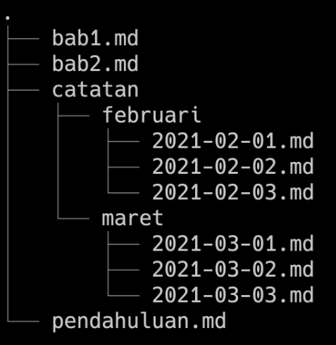

# Unix Command Line

---

<p> <strong>Shell</strong>, program yang digunakan untuk berkomunikasi atau memerintah sistem </p>
<p> <strong>CLI</strong> atau command line interface, jenis shell yang berbasis teks </p>
<p> <strong>Terminal emulator</strong>, aplikasi untuk mengakses cli </p>
<p> <strong>File system</strong>, Kegunaan nya mengatur bagaimana data disimpan didalam sebuah system </p>


<p> <strong>Command</strong></p>
<ol>
<li>head, tail, cat untuk isi file diawal, akhir, dan keseluruhan</li>
<li>touch untuk membuat file</li>
<li>mkdir untuk membuat directory</li>
<li>cp untuk menyalin file, cp -R untuk menyalin directory</li>
<li>mv untuk memindahkan file, mv-R untuk memindahkan directory</li>
<li>rm untuk menghapus file, rm-R atau rm-d untuk menghapus directory</li>
</ol>

# Git dan Github

---

<p> <strong>Git</strong> adalah aplikasi yang dapat melacak setiap perubahan yang terjadi pada suatu folder atau file.</p>
<p> <strong> Github </strong> merupakan manajemen project, sistem versioning code, sekaligus platform jaringan sosial bagi para developer seluruh dunia</p>
<p><strong>Kenapa wajib mengguanakan git&github</strong>, karena programmer tidak akan bekerja sendirian , pasti membutuhkan bantuan tim. hampir semua perusahaan berbasis teknologi telah menggunakan kedua platform ini untuk pekerjaan karyawannya</p>

#### Setup awal git

<p>git config --global user.name "Zuhri Agusdino"</p>
<p>git config --global user.email zuhriagusdino92@gmail.com</p>
<p>cek apakah instalasi berhasil, git --version</p>
<p>cek apakah setup berhasil, git config --list</p>
<p><strong>Repository</strong>, direktori proyek yang kita buat</p>
<p>membuat repository, git init namarepository</p>
<p>mengecek apakah ada perubahan pada git, git status</p>
<p>menghubungkan remote repository dengan project lokal yang telah dibuat direktorinya, git remote</p>
<p>menambah file baru atau menambahkan file yang telah diubah, git add</p>
<p>mengecek apakah ada perubahan pada git, git status</p>
<p>menyimpan perubahan pada git, git commit -m "commit massage"</p>
<p>mengirimkan perubahan file ke remote repository, git push -u origin master</p>
<p>membuat branch baru, git branch -b (nama branch)</p>
<p>berpindah branch, git checkout</p>
<p>menggabungkan branch cabang ke branch master, git merge atau git merge origin/(nama branch)</p>

# HTML

---

<p><strong>HTML</strong> adalah singkatan dari hypertext markup language, digunakan untuk menampilkan konten pada browser</p>
<p>Tools pendukung dalam menggunakan html adalah text editor dan browser. contoh text editor adalah visual studio code dan sublime text.</p>

### Teks HTML sederhana

```html
<!DOCTYPE html>
<html lang="en">
	<head>
		<title>Html Sederhana</title>
	</head>
	<body>
		<p>membuat teks html sederhana</p>
	</body>
</html>
```

#### Tag HTML

<p> adalah sebuah penanda awalan dari sebuah elemen di HTML. Tag dibuat dengan kurung siku (<..>) lalu didalam nya berisi nama tag dan kadang juga ditambahkan dengan atribut. Atribut adalah properti dari elemen HTML, contohnya id,class,name.</p>

- Tag <'html'> untuk memulai dokumen html
- Tag <'head'> untuk membuat bagian head
- Tag <'title'> untuk membuat judul
- Tag <'body'> untuk membuat bagian body
- Tag <'h1'> sampai <'h6'> untuk membuat heading pada artikel
- Tag <'p'> untuk membuat paragraf
- Tag <'!-- --'> untuk memberikan komentar

#### Elemen semantik HTML

<p>adalah elemen-elemen yang menyatakan makna atau tujuan dari elemen tersebut.Salah satu keuntungan menggunakan elemen semantik adalah dokumen HTML kita akan mudah dibaca</p>

#### Contoh Tag semantik HTML

- Tag <'footer'> untuk membuat elemen footer atau bagian kaki dari web
- Tag <'article'> untuk membuat elemen article
- Tag <'aside'> untuk membuat elemen bagian samping
- Tag <'header'> untuk membuat kepala kop dari web
- Tag <'main'> untuk membuat elemen utama
- Tag <'nav'> untuk membuat navigasi
- Tag <'section'> untuk membuat bagian artikel

#### Deploy HTML

<p>Deploy adalah sebuah proses untuk menyebarkan aplikasi yang sudah kita kerjakan supaya bisa digunakan oleh orang-orang. Jika aplikasi kita HTML atau Web App kita perlu mendeploy ke server. Dalam mendeploy HTML kita menggunakan tools bernama <b>Netlify</b></p>

# CSS

---

#### CSS atau Cascading stlye sheets

<p>berfungsi untuk menjelaskan dan menata tampilan elemen yang tertulis pada bahasa markup, salah satunya adalah HTML.Jadi css digunakan untuk mendesain halaman website dengan mengubah warna, menggunakan font custom, editing text format, mengatur tata letak.</p>

#### Menyisipkan CSS kedalam HTML

- Menggunakan CSS inline, CSS inline adalah sebuah kode CSS yang kita sematkan pada element apa pun di dalam body HTML, langsung menggunakan atribut style

```
<button style="color: red">Masuk</button>
<button style="color: blue; border: 2px solid green">
  Daftar
</button>
```

- Menggunakan CSS internal, CSS internal adalah CSS yang diletakkan pada bagian head suatu halaman HTML.

```
<!DOCTYPE html>
<html lang="en">
<head>
  <meta charset="UTF-8">
  <meta http-equiv="X-UA-Compatible" content="IE=edge">
  <meta name="viewport" content="width=device-width, initial-scale=1.0">
  <title>CSS Internal</title>

  <style>
    a {
      padding: 8px 16px;
      border-radius: 4px;
      color: white;
      background-color: #8d68e8;
      text-decoration: none;
      font-family: Arial, Helvetica, sans-serif;
    }
  </style>
</head>
<body>
  <a href="#">Beranda</a>
  <a href="#">Tentang Kami</a>
</body>
</html>
```

- Menggunakan CSS eksternal, Yang dimaksud eksternal adalah kita membuat file tersendiri yang berekstensi css. Kemudian file tersebut kita hubungkan ke dalam halaman HTML menggunakan tag link

```
Kita bisa menambahkan tag <link> pada bagian <head> yang mengarah kepada file style/app.css seperti berikut

<html lang="en">
<head>
  <meta charset="UTF-8">
  <meta http-equiv="X-UA-Compatible" content="IE=edge">
  <meta name="viewport" content="width=device-width, initial-scale=1.0">
  <title>CSS Eksternal</title>

  <link rel="stylesheet" href="./style/app.css">
</head>
<body>
  <a href="#">Beranda</a>
  <a href="#">Tentang Kami</a>
</body>
</html>

Sedangkan isi file CSS

a {
  padding: 8px 16px;
  border-radius: 4px;
  color: white;
  text-decoration: none;
  font-family: Arial, Helvetica, sans-serif;
}

a:first-of-type {
  background-color: #1fc296;
}

a:last-of-type {
  background-color: #d45a5a;
}
```

#### Sintaks dasar CSS

<p>Sintaks CSS terdiri dari tiga bagian:(selector),(property),(value).Selektor biasanya adalah elemen atau tag HTML yang akan didefinisikan, properti adalah atribut yang akan diganti dengan nilai tertentu. Properti dan nilai dipisahkan dengan tanda titik dua (:) dan keduanya diapit oleh tanda kurung kurawal ({).</p>

```
Sintaks css

p{
	color: red;
}


- p adalah selector berupa elemen html yang akan diubah
- color adalah prroperti berupa bagian yang akan diubah. contoh diatas adalah kita akan mengubah warna dari teks yang ada didalam elemen p
- red adalah value atau nilai berupa warna merah
```

#### Flexbox

<p>Flexbox adalah cara untuk mengatur layout. Flexbox direkomendasikan karena penggunaannya yang mudah dan didukung oleh kebanyakan browser. Flexbox terdiri dari 1 parent atau container dan bisa beberapa child</p>
<p>Flex direction digunakan untuk mengatur letak child, sedangkan flex warp mengatur tata letak child pada 1 line</p>
<p>Flex flow yaitu digunakan sebagai shortcut untuk set up flex-direction dan flex-wrap secara bersamaan.sedangkan Order digunakan untuk ordering item yang ingin diatur posisinya</p>

- Justify - content digunakan untuk mengatur tata letak antar item child secara horizontal
- Align - content digunakan untuk mengatur tata letak antar item child secara vertikal atau cross axis
- Flex-grow digunakan untuk mengatur size suatu item child pada flexbox
- Flex-shrink digunakan untuk memperkecil size suatu item child secara relatif terhadap item child lainnya
- flex-basis digunakan untuk mengatur width setiap item child

# Algoritma

---

#### Algoritma

<p><b>Algoritma</b> adalah deskripsi berupa step-step yang dibutuhkan untuk menyelesaikan suatu masalah, untuk menyelesaikan suatu masalah, kita harus mempunyai <b>data struktur</b>. data inilah yang akan kita gunakan untuk menyelesaikan suatu masalah dengan menggunakan algoritma..</p>

#### Manfaat menggunakan algoritma

- membantu menyelesaikan suatu masalah dengan logika dan sistematis
- Mempermudah pembuatan program yang dapat menyelesaikan masalah tertentu.
- Membantu menyederhanakan suatu program yang rumit dan juga besar.

#### Kualitas wajib algoritma

- Input dan output harus didefinisikan terlebih dahulu dengan tepat
- Setiap step harus benar-benar clear dan tidak ambigu
- Algoritma seharusnya tidak mengandung suatu code pada bahasa pemograman tertentu. Algoritma harus dibuat agar dapat digunakan dalam bahasa pemograman apapun

#### Contoh Algoritma sederhana

```
input 1 = 5
input 2 = 7
output = input 1 + input 2
print ("Result", output)
```

#### Pseudocode

<p> Pseudocode adalah menuliskan algoritma sebelum kita implementasikan ke bahasa pemograman tertentu. </p>

<p> Menulis pseudocode </p>

- Huruf kapital digunakan untuk menulis perintah
- 1 statement hanya terdiri dari 1 baris
- Harus bersifat spesifik dan simple
- Menggunakan indentasi

<p> Contoh pseudocode </p>

```
STORE "width" with any number
STORE "height" with any nummber
STORE "area" without any value

CALCULATE "width" times "height"
SET "area" value with calculation result
DISPLAY "area"
```

#### Contoh pseudocode

- Procedural : cara berpikir secara runtun. Artinya serangkaian perintah yang berurutan.\
- Conditional : digunakan saat dibutuhkan percabangan kasus. Komputer akan melakukan suatu tindakan jika suatu kondisi terpenuhi.
- Looping : Jika membutuhkan perulangan dalam kasus tertentu, kita bisa menggunakan Looping.
- Recursive : pola pikir dalam algoritma yang memanggil method/function didalam sebuah function.

# JAVASCRIPT Dasar

---

#### Javascript

<p> Javascript adalah bahasa pemrograman yang sangat powerful yang digunakan untuk logic sebuah website. Javascript juga membuat sebuah website menjadi interaktif dan dinamis.</p>
<p>Cara untuk menjalankan javascript adalah melalui browser. google chrome adalah yang sering digunakan.</p>

#### Tipe data pada javascript

- Number : tipe data yang mengandung semua jenis angka
- String : tipe data yang berisi teks, terdiri dari huruf,angka,spasi , simbol
- boolean : memiliki nilai true or false
- null : tipe data pada variabel/data yang tidak memiliki nilai
- undefined : tipe data yang merepresentasikan varibel/data yang tidak memiliki nilai
- object : tipe data yg dapat berisi berbagai nilai dan berhubungan dengan dunia nyata
- array : salah satu tipe data terstruktur (structured data type) yang terdiri dari sejumlah komponen-komponen yang mempunyai tipe data yang sama

#### Variabel

<p>Variabel merupakan container atau  wadah yang digunakan untuk menyimpan data atau nilai. Di javascript ada 3 cara untuk mendeklarasikan variabel : </p>

- menggunakan let
- menggunakan var
- menggunakan const

#### Operator

<p>Operator adalah simbol yang digunakan untuk melakukan operasi pada suatu nilai dan variabel.</p>

#### Jenis operator

- operator aritmatika
  <p>operator ini terdiri dari :

  - penjumlahan +
  - pengurangan -
  - perkalian \*
  - pembagian /
  - pemangkatan \*\*
  - sisa bagi atau modulus %
  </p>

- operator penugasan / assignment
  <p>Operator penugasan adalah operator yang digunakan untuk memberikan tugas kepada variabel. Biasanya digunakan untuk mengisi variabel. macam macam operator penugasan :

  - pengisian nilai =
  - pengisian dan penambahan +=
  - pengisian dan pengurangan -=
  - pengisian dan perkalian \*=
  - pengisian dan pemangkatan \*\*=
  - pengisian dan pembagian /=
  - pengisian dan sisa bagi %=
  </p>

- operator perbandingan
  <p>Operator relasi atau perbandingan adalah operator yang digunakan untuk membandingkan dua nilai. macam macam operator perbandingan :

  - lebih besar >
  - lebih kecil <
  - sama dengan == atau ===
  - tidak sama dengan != atau !==
  - lebih besar sama dengan >=
  - lebih kecil sama dengan <
  </p>

- operator logika
  <p>Operator logika digunakan untuk melakukan operasi terhadap dua nilai boolean

  - logika AND &&
  - logika OR ||
  - negasi atau kebalikan !
  </p>

  #### Conditional

  <p>Conditional merupakan statement percabangan yang menggabarkan suatu kondisi, Conditional statement akan melakukan pengecekan pada kondisi fisik dan menjalankan perintah berdasarkan kondisi tersebut</p>

- IF Conditional
  <p>Percabangan if merupakan percabangan yang hanya memiliki satu blok pilihan saat kondisi bernilai benar.</p>

```html
Contoh IF conditional : if (true) { console.log('selamat pagi') } jika hasil nya
true maka akan menampilkan output selamat pagi
```

- ELSE/IF Conditional
<p>Percabangan if/else merupakan percabangan yang memiliki dua blok pilihan. Pilihan pertama untuk kondisi benar, dan pilihan kedua untuk kondisi salah (else).</p>

```html
contoh else/if conditional let perut = 'kenyang' if (perut === 'kenyang') {
console.log('sudah kenyang') } else if (perut === 'lapar') { console.log('perut
lapar') } jika kenyang , output yang akan tampil adalah sudah kenyang. jika
lapar , output yang akan tampil adalah perut lapar.
```

- IF ELSE IF Conditional
<p>Percabangan if/else/if merupakan percabangan yang memiliki lebih dari dua blok pilihan.</p>

```html
let perut = 'bingung' if (perut === 'kenyang') { console.log('sudah kenyang') }
else if (perut === 'lapar') { console.log('perut lapar') } else {
console.log('tidak mau makan') } jika kenyang , output yang akan tampil adalah
sudah kenyang. jika lapar , output yang akan tampil adalah perut lapar. jika
pilihan selain kenyang atau lapar , output adalah tidak mau makan
```

- Swith case
<p>Percabangan switch/case adalah bentuk lain dari percabangan if/else/if.</p>

```html
let warna = "merah"; switch (warna){ case "merah": console.log ("warna merah");
break; case "kuning": console.log ("warna kuning"); break; case "hijau":
console.log ("warna hijau"); break; default: console.log ("warna tidak
ditemukan"); } output yang keluar adalah sesuai pilihan, jika pilihan tidak ada
maka output yang keluar adalah warna tidak ditemukan
```

- Ternary operator
<p>Percabangan menggunakan opreator ternary merupakan bentuk lain dari percabangan if/else. bisa disebut bentuk singkat dari if/else</p>

```html
let makan = true makan ? console.log('sudah kenyang') : console.log('lapar');
jika nilai nya true maka outputnya adalah sudah kenyang, jika false outputnya
lapar.
```

#### Looping

<p>looping adalah sebuah statement yang mengulang sebuah intruksi hingga kondisi terpenuhi atau jika kondisi stop/berhenti tercapai.</p>

- For loop
<p>Perulangan for merupakan perulangan yang termasuk dalam couted loop, karena sudah jelas berapa kali ia akan mengulang.</p>

```html
let nilai = 1 ; for (nilai; nilai <= 10 ; nilai++){ console.log(nilai) }
outputnya adalah tampilan angka 1 sampai 10
```

- While loop
<p>Perulangan while merupakan perulangan yang termasuk dalam perulangan uncounted loop.</p>

```html
let count = 1 ; while (count < 10){ console.log(count); count ++ ; }
```

- Do While loop
<p>Perulangan do/while akan melakukan perulangan sebanyak 1 kali terlebih dahulu, lalu mengecek kondisi yang ada di dalam kurung while.</p>

```html
count = 1 ; do { console.log(count); count ++ ; } while (count <= 10)
```
